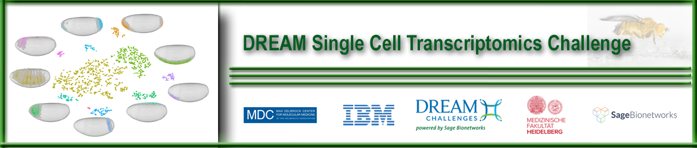

# Single-Cell-Challenge

## Overview
Single-cell sequencing technologies are rapidly evolving. In particular, although suspension single-cell RNA sequencing has become high-throughput, it loses the spatial information encoded in the position of a cell from a tissue or organism.

## Challenge
* In order to evaluate methods that reconstruct the location of single cells in the Drosophila embryo using single-cell transcriptomic data, DREAM and SAGE Bioinformatics organized the DREAM Single-Cell Transcriptomics challenge.
* By providing public availability of RNA sequencing data, they devised a scoring and cross-validation scheme to evaluate the robustness and effectiveness of the top performing algorithms.

## Results
* The best algorithm known thus far was developed by Robert P. Zinzen et al. in a paper "The Drosophila Embryo at Single Cell Transcriptome Resolution" where they formulated an approach maximizing the Matthew's correlation coefficient between marker genes and the single cell sequences.
* The 34 participating teams used an array of methods and results show that the selection of genes was essential for accurately locating the cells in the embryo. This strategy led to the identification of archetypal gene expression patterns and spatial markers as participants were able to correctly localize rare subpopulations of cells, accurately mapping both spatially restricted and scattered groups of cells.

## Our approach
Our team used a combination of optimization strategies utilizing data imputation, optimization algorithms, and deep learning. For example, we tried using data from gene2function to improve our features. This is done with manifold leraning. See notebook in this folder.
